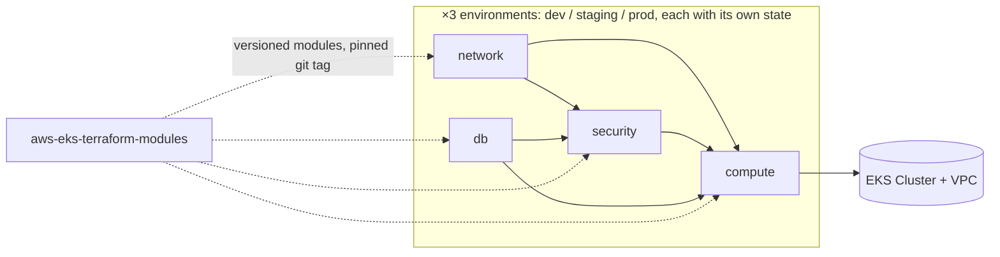
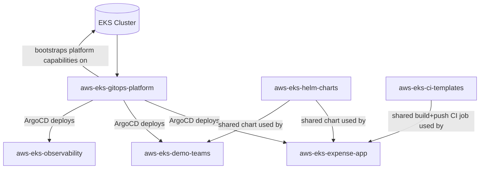

# aws-eks-gitops-platform

**Entry point for an 8-repo AWS/EKS platform-engineering project**: a multi-tenant, multi-environment-ready Kubernetes platform built from independently-versioned, **reusable building blocks** — layered Terraform (network/db/security/compute × dev/staging/prod), a shared Helm chart, a shared CI template — delivered via GitOps, with security/isolation guardrails verified against a live cluster, and a demo application running on top of it.

## Background

This started as a comparison of three ways to run the same app on AWS — **Lambda, ECS Fargate, and EKS** — to weigh cost, operational overhead, and networking complexity against each other with a real workload, not a whiteboard exercise. After that trade-off analysis, EKS was chosen as the platform to go deep on: it's the option real infrastructure/SRE/platform teams actually operate day to day, and it's the one with the most to design and get wrong.

Everything in these 8 repos is what came out of going deep on that choice: a layered Terraform setup, reusable modules, GitOps delivery via ArgoCD, and — the most recent and most substantial piece — a real multi-tenant isolation design (network policy, resource quotas, RBAC, per-team ArgoCD projects) verified against a live cluster, bugs included.

## Architecture

### 1. Provisioning the infrastructure (layered Terraform, per environment)

Only `dev` has actually been applied end-to-end; `staging`/`prod` are the same layer structure, scaffolded but not yet built.

### 2. Running on the cluster (GitOps + repo relationships)

## The 8 repos, and why they're split

Each repo has its own README with real depth — the **Highlight** column below is the actual substance, not a teaser; click through only if you want the full story.

| Repo | What it is | Highlight |
|---|---|---|
| **[aws-eks-gitops-platform](.)** *(this repo)* | ArgoCD Applications/AppProjects, NetworkPolicy, ResourceQuota/LimitRange, RBAC | Platform-owned guardrails, **deliberately not editable** by the teams they constrain — see "Verified live" below for the real bugs found testing them |
| **[aws-eks-infra](https://github.com/josephine-525/aws-eks-infra)** | Layered Terraform (network / db / security / compute), per environment, own state per layer | Real dependency graph enforced by CI `needs:` (not just stage order) — `plan_security` can't run until `apply_db` actually publishes its SSM output |
| **[aws-eks-terraform-modules](https://github.com/josephine-525/aws-eks-terraform-modules)** | Versioned Terraform modules (VPC, EKS compute, IAM, ECR, DynamoDB) | `v1.1.0` added 2 new modules with **zero changes** to existing consumers; `v2.0.0` was a real breaking-change bump forced by a hardcoded IRSA trust-policy bug — both in the repo's actual tag history, not a hypothetical |
| **[aws-eks-expense-app](https://github.com/josephine-525/aws-eks-expense-app)** | The demo application (Python backend + Nginx frontend) | Originally deployed to **Lambda, ECS Fargate, and EKS from the same codebase** to compare them with a real workload before choosing EKS |
| **[aws-eks-helm-charts](https://github.com/josephine-525/aws-eks-helm-charts)** | One shared Helm chart, parameterized by `values.yaml` | **One chart, 3 independently-versioned workloads** (the real app + 2 demo tenants) — proves reuse via values alone, not copy-pasted per team |
| **[aws-eks-ci-templates](https://github.com/josephine-525/aws-eks-ci-templates)** | A reusable GitLab CI build+push template | Adding a new app repo means writing `DOCKERFILE_PATH`/`ECR_REPO` parameters and `include:`-ing this — not a new CI job |
| **[aws-eks-observability](https://github.com/josephine-525/aws-eks-observability)** | kube-prometheus-stack values + dashboard delivery | Platform owns *how* Prometheus/Grafana get installed; each team owns its *own* dashboard content — collected cluster-wide via one ApplicationSet |
| **[aws-eks-demo-teams](https://github.com/josephine-525/aws-eks-demo-teams)** | Two intentionally trivial placeholder tenants | Without a 2nd/3rd tenant, cross-namespace isolation can't actually be tested — one tenant proves nothing |

## What this project is actually about

Not "I deployed an app to Kubernetes" — **multi-tenant platform design, real reuse across independently-versioned repos, and live verification of the guardrails that make multi-tenancy real**:

- **Namespace-per-team isolation**: `NetworkPolicy` (default-deny + explicit allow-baseline), `ResourceQuota`/`LimitRange`, per-team ArgoCD `AppProject` (scoped `sourceRepos`/`destinations`/`clusterResourceWhitelist`), and read-only RBAC — reasoned through from first principles (see each repo's README for the *why* behind every scoping decision), not copy-pasted from a blog post.
- **Reusability with evidence, not just intent**: `aws-eks-terraform-modules` gained 2 modules in `v1.1.0` with zero impact on existing consumers; `aws-eks-helm-charts`' one chart runs 3 different, independently-versioned workloads; `aws-eks-ci-templates`' one build job is `include`d by every app repo. Adding a new team or app means writing config against these, not new pipeline/module/chart code.
- **A real security design boundary, not an arbitrary folder split**: `aws-eks-terraform-modules`' `security`/`compute` split exists because an IRSA role's trust policy is federated to the cluster's own OIDC provider — which doesn't exist until the cluster does. `security` owns *what's allowed*; `compute` has to own *who's trusted* whenever that trust is federated to a resource it creates itself.
- **Designed for multiple environments from the start, not just multiple teams**: `aws-eks-infra`'s layered Terraform (network/db/security/compute) is fully replicated across `dev`/`staging`/`prod` directories — same versioned modules, same layer dependency graph, just a different environment folder. Only `dev` has actually been built and exercised live in this demo; the reusable pieces (modules, chart, CI template, isolation guardrails) don't know or care which environment they're running in, so extending the GitOps layer to target multiple clusters (vs. today's single in-cluster ArgoCD) is the one remaining scoped step, not a redesign.

## Verified live, not just "applies cleanly"

Building these guardrails was the easy part. Verifying them against a real cluster surfaced real bugs — most with the same shape: **the control plane reported success while the actual runtime behavior silently wasn't there.** A few worth calling out:

- **NetworkPolicy objects applied cleanly and enforced nothing.** AWS VPC CNI's NetworkPolicy enforcement is off by default — `kubectl apply` succeeding on a `NetworkPolicy` is not evidence it's enforced. Found via a live cross-namespace connectivity test that should have timed out and didn't; fixed by managing VPC CNI as a real Terraform-managed EKS addon with `enableNetworkPolicy` explicitly turned on.
- **ResourceQuota/LimitRange sized for the app alone rejected every pod outright**, because a cluster-wide observability addon auto-injects 4 extra instrumentation init containers into *every* pod — sizing a namespace's guardrails means checking what admission webhooks inject, not just what the app itself declares.
- **A Prometheus Operator that looked stuck forever**: it turns out the operator only checks which CRDs exist once, at its own startup, and never rechecks — a CRD created moments after the operator started was invisible to it until the operator was restarted.
- **A manually-triggered ArgoCD sync silently dropped the sync options that were already fixing a different bug**: patching an `Application`'s `.operation.sync` directly via `kubectl` does not inherit `spec.syncPolicy.syncOptions` — omit it and `ServerSideApply`/`Replace` (already set in the Application's own spec, for a real reason) get silently ignored for that one sync.
- **An IRSA role's trust policy was hardcoded to a retired ServiceAccount name**, inside a reusable module whose own design rule was "zero environment-specific hardcoding" — silently wrong once the real ServiceAccount name changed. Every DynamoDB call failed with `AssumeRoleWithWebIdentity AccessDenied` until it was made a required input instead of a module-side default.

The full log (`aws-eks-infra`'s README) has 10+ more of these, including EKS control-plane/node-group version upgrades done live with zero downtime, `CrashLoopBackOff`/readiness-probe debugging, and a webhook TLS certificate rotation issue — this page has the highlights, that page has the blow-by-blow.

---

*This is a personal learning project used to practice the kind of infrastructure a real platform/SRE team operates — not a production system, and some choices (single-account, no formal environment promotion) reflect that scope deliberately.*
