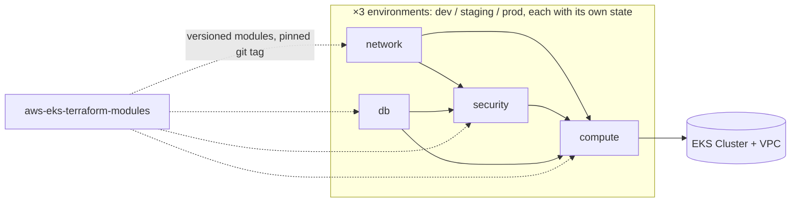
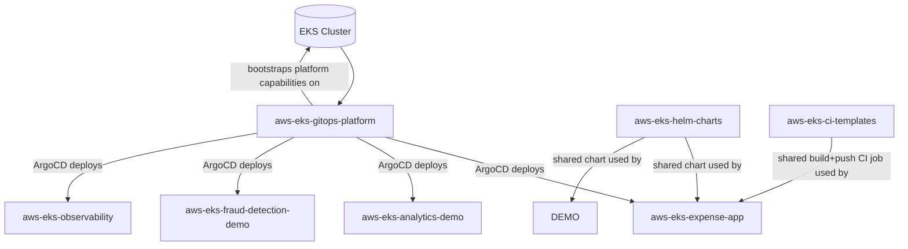

# aws-eks-gitops-platform

**Entry point for a 10-repo AWS/EKS platform-engineering project**: a multi-tenant, multi-environment-ready Kubernetes platform built from independently-versioned, **reusable building blocks** — layered Terraform (network/db/security/compute × dev/staging/prod), a shared Helm chart, a shared CI template — delivered via GitOps, with security/isolation guardrails verified against a live cluster, and a demo application running on top of it.

## Background

This started as a comparison of three ways to run the same app on AWS — **Lambda, ECS Fargate, and EKS** — to weigh cost, operational overhead, and networking complexity against each other with a real workload, not a whiteboard exercise. After that trade-off analysis, EKS was chosen as the platform to go deep on: it's the option real infrastructure/SRE/platform teams actually operate day to day, and it's the one with the most to design and get wrong.

Everything in these 10 repos is what came out of going deep on that choice: a layered Terraform setup, reusable modules, GitOps delivery via ArgoCD, and — the most recent and most substantial piece — a real multi-tenant isolation design (network policy, resource quotas, RBAC, per-team ArgoCD projects) verified against a live cluster, bugs included.

## Architecture

### 1. Provisioning the infrastructure (layered Terraform, per environment)


```mermaid
graph LR
    subgraph ENV["×3 environments: dev / staging / prod, each with its own state"]
        NET[network] --> SEC[security]
        DB[db] --> SEC
        NET --> COMP[compute]
        SEC --> COMP
        DB --> COMP
    end
    TM[aws-eks-terraform-modules] -.->|versioned modules, pinned git tag| NET
    TM -.-> DB
    TM -.-> SEC
    TM -.-> COMP
    COMP --> EKS[(EKS Cluster + VPC)]
```

Only `dev` has actually been applied end-to-end; `staging`/`prod` are the same layer structure, scaffolded but not yet built.

### 2. Running on the cluster (GitOps + repo relationships)


```mermaid
graph TD
    EKS[(EKS Cluster)] --> GITOPS[aws-eks-gitops-platform]
    GITOPS -->|bootstraps platform capabilities on| EKS
    GITOPS -->|ArgoCD deploys| APP[aws-eks-expense-app]
    GITOPS -->|ArgoCD deploys| DEMO1[aws-eks-analytics-demo]
    GITOPS -->|ArgoCD deploys| DEMO2[aws-eks-fraud-detection-demo]
    GITOPS -->|ArgoCD deploys| OBS[aws-eks-observability]
    HELM[aws-eks-helm-charts] -->|shared chart used by| APP
    HELM -->|shared chart used by| DEMO
    CI[aws-eks-ci-templates] -->|shared build+push CI job used by| APP
```

## The 10 repos, and why they're split

Each repo has its own README with real depth — the **Highlight** column below is the actual substance, not a teaser; click through only if you want the full story.

| Repo | What it is | Highlight |
|---|---|---|
| **[aws-eks-gitops-platform](.)** *(this repo)* | ArgoCD Applications/AppProjects, NetworkPolicy, ResourceQuota/LimitRange, RBAC | Platform-owned guardrails, **deliberately not editable** by the teams they constrain — see "Verified live" below for the real bugs found testing them |
| **[aws-eks-infra](https://github.com/josephine-525/aws-eks-infra)** | Layered Terraform (network / db / security / compute), per environment, own state per layer | Real dependency graph enforced by CI `needs:` (not just stage order) — `plan_security` can't run until `apply_db` actually publishes its SSM output |
| **[aws-eks-terraform-modules](https://github.com/josephine-525/aws-eks-terraform-modules)** | Versioned Terraform modules (VPC, EKS compute, IAM, ECR, DynamoDB) | `v1.1.0` added 2 new modules with **zero changes** to existing consumers; `v2.0.0` was a real breaking-change bump forced by a hardcoded IRSA trust-policy bug — both in the repo's actual tag history, not a hypothetical |
| **[aws-eks-expense-app](https://github.com/josephine-525/aws-eks-expense-app)** | The demo application (Python backend + Nginx frontend) | Originally deployed to **Lambda, ECS Fargate, and EKS from the same codebase** to compare them with a real workload before choosing EKS |
| **[aws-eks-helm-charts](https://github.com/josephine-525/aws-eks-helm-charts)** | One shared Helm chart, parameterized by `values.yaml` | **One chart, 3 independently-versioned workloads** (the real app + 2 demo tenants) — proves reuse via values alone, not copy-pasted per team |
| **[aws-eks-ci-templates](https://github.com/josephine-525/aws-eks-ci-templates)** | A reusable GitLab CI build+push template | Adding a new app repo means writing `DOCKERFILE_PATH`/`ECR_REPO` parameters and `include:`-ing this — not a new CI job |
| **[aws-eks-observability](https://github.com/josephine-525/aws-eks-observability)** | kube-prometheus-stack values + centralized dashboards-as-code | Platform owns *how* Prometheus/Grafana get installed; dashboard content is centralized (not per-app) and collected cluster-wide via one directory-recursing Application |
| **[aws-eks-analytics-demo](https://github.com/josephine-525/aws-eks-analytics-demo)** | Demo tenant #1 -- Kafka consumer, aggregates `expense.created` events | Split into its own repo 2026-10-05 (was combined with fraud-detection-demo in one `aws-eks-demo-teams` repo) -- independent tenants, no shared code or lifecycle, same split as the private repos they mirror |
| **[aws-eks-fraud-detection-demo](https://github.com/josephine-525/aws-eks-fraud-detection-demo)** | Demo tenant #2 -- Kafka consumer, flags suspicious expenses, reports back over HTTP | The one real cross-team call in the whole platform (everything else crosses team boundaries only through Kafka) -- the deliberate target for the service-mesh `AuthorizationPolicy` work |
| **[aws-eks-idp-cli](https://github.com/josephine-525/aws-eks-idp-cli)** | A Go IDP scaffolding CLI + self-service portal experiment | Scaffolds a new service's Helm values/CI config/GitOps manifests and opens a merge request via the GitLab API; evaluated deploying the portal itself onto this platform and made the call not to yet — a solo project has no second user for a shared-credential portal to actually protect |

## What this project is actually about

Not "I deployed an app to Kubernetes" — **multi-tenant platform design, real reuse across independently-versioned repos, and live verification of the guardrails that make multi-tenancy real**:

- **Namespace-per-team isolation**: `NetworkPolicy` (default-deny + explicit allow-baseline), `ResourceQuota`/`LimitRange`, per-team ArgoCD `AppProject` (scoped `sourceRepos`/`destinations`/`clusterResourceWhitelist`), and read-only RBAC — reasoned through from first principles (see each repo's README for the *why* behind every scoping decision), not copy-pasted from a blog post.
- **Reusability with evidence, not just intent**: `aws-eks-terraform-modules` gained 2 modules in `v1.1.0` with zero impact on existing consumers; `aws-eks-helm-charts`' one chart runs 3 different, independently-versioned workloads; `aws-eks-ci-templates`' one build job is `include`d by every app repo. Adding a new team or app means writing config against these, not new pipeline/module/chart code.
- **A real security design boundary, not an arbitrary folder split**: `aws-eks-terraform-modules`' `security`/`compute` split exists because an IRSA role's trust policy is federated to the cluster's own OIDC provider — which doesn't exist until the cluster does. `security` owns *what's allowed*; `compute` has to own *who's trusted* whenever that trust is federated to a resource it creates itself.
- **Designed for multiple environments from the start, not just multiple teams**: `aws-eks-infra`'s layered Terraform (network/db/security/compute) is fully replicated across `dev`/`staging`/`prod` directories — same versioned modules, same layer dependency graph, just a different environment folder. Only `dev` has actually been built and exercised live in this demo; the reusable pieces (modules, chart, CI template, isolation guardrails) don't know or care which environment they're running in, so extending the GitOps layer to target multiple clusters (vs. today's single in-cluster ArgoCD) is the one remaining scoped step, not a redesign.

## Verified live, not just "applies cleanly"

Building these guardrails was the easy part. Verifying them against a real cluster surfaced real bugs — most with the same shape: **the control plane reported success while the actual runtime behavior silently wasn't there.** A few worth calling out:

- **NetworkPolicy objects applied cleanly and enforced nothing.** AWS VPC CNI's NetworkPolicy enforcement is off by default — `kubectl apply` succeeding on a `NetworkPolicy` is not evidence it's enforced. Found via a live cross-namespace connectivity test that should have timed out and didn't; fixed by managing VPC CNI as a real Terraform-managed EKS addon with `enableNetworkPolicy` explicitly turned on.
- **ResourceQuota/LimitRange sized for the app alone rejected every pod outright**, because a cluster-wide observability addon auto-injects 4 extra instrumentation init containers into *every* pod — sizing a namespace's guardrails means checking what admission webhooks inject, not just what the app itself declares.
- **A Prometheus Operator that looked stuck forever**: it turns out the operator only checks which CRDs exist once, at its own startup, and never rechecks — a CRD created moments after the operator started was invisible to it until the operator was restarted.
- **A manually-triggered ArgoCD sync silently dropped the sync options that were already fixing a different bug**: patching an `Application`'s `.operation.sync` directly via `kubectl` does not inherit `spec.syncPolicy.syncOptions` — omit it and `ServerSideApply`/`Replace` (already set in the Application's own spec, for a real reason) get silently ignored for that one sync.
- **An IRSA role's trust policy was hardcoded to a retired ServiceAccount name**, inside a reusable module whose own design rule was "zero environment-specific hardcoding" — silently wrong once the real ServiceAccount name changed. Every DynamoDB call failed with `AssumeRoleWithWebIdentity AccessDenied` until it was made a required input instead of a module-side default.

- **A service mesh (Istio), added for zero-trust between workloads, broke every non-mesh caller the moment mTLS went `STRICT` — the fix was recognizing which Istio object actually owns "who's allowed," not loosening mTLS.** The ALB and Prometheus (neither ever has a sidecar) both started failing outright; the real fix moved identity enforcement to `AuthorizationPolicy` (a `DENY`-action policy protecting one sensitive endpoint, not a blanket `ALLOW` policy enumerating everything else) and left `PeerAuthentication` at `PERMISSIVE` — which doesn't weaken real mesh-to-mesh traffic, Istio's own auto-mTLS still upgrades that automatically. A second mesh-specific bug, same "looked fine, wasn't" shape as the others here: NetworkPolicy rules written against a Service's port silently stop matching once both call sides join the mesh, because Envoy then routes pod-to-pod directly to the container's real port, bypassing the Service entirely.

The full log (`aws-eks-infra`'s README for Terraform/EKS-cluster bugs, **this repo's own README below for the full service-mesh findings**) has 10+ more of these, including EKS control-plane/node-group version upgrades done live with zero downtime, `CrashLoopBackOff`/readiness-probe debugging, a webhook TLS certificate rotation issue, and a real, cited AWS VPC CNI controller limitation found testing a negative-authorization control — this page has the highlights, those pages have the blow-by-blow.

---

*This is a personal learning project used to practice the kind of infrastructure a real platform/SRE team operates — not a production system, and some choices (single-account, no formal environment promotion) reflect that scope deliberately.*

---

# gitops (this repo's own technical README)

ArgoCD Application/ApplicationSet definitions for the `demoapp-dev` EKS cluster, plus the pipeline that bootstraps the cluster's platform capabilities. This repo owns the delivery *plumbing* — content (Helm values, dashboards, Ingress manifests) lives in each app's own repo.

## What's here

```
gitops/
├── applications/
│   ├── kube-prometheus-stack.yaml    # Multi-source Application: upstream chart + observability repo's values.yaml
│   ├── observability-dashboards.yaml # Plain-directory Application, path: teams, directory.recurse: true --
│   │                                  #   watches the centralized observability-dashboards repo (see below)
│   ├── team-payments-ingress.yaml    # Plain-directory Application: expenseapp's ingress/ path
│   └── kafka-operator.yaml           # Helm-source Application: strimzi.io/charts, release name pinned to
│                                      #   match the original manual `helm install` so ArgoCD adopts the
│                                      #   existing release instead of duplicating it (see Design decisions)
├── applicationsets/
│   └── expense-teams.yaml            # Git files generator, path: services/**/*.yaml (see below and services/)
├── services/
│   └── <team>/<name>.yaml            # One file per ApplicationSet element -- name/namespace/project/
│                                      #   valuesRepoURL/valuesFile, same fields the old List generator's
│                                      #   elements carried. idp-cli's publish-appset-mr job adds one of
│                                      #   these per new service; nothing here is hand-edited for that case.
├── kafka/                            # StorageClass + Kafka + KafkaNodePool + KafkaTopic -- plain
│   ├── storageclass.yaml             #   `kubectl apply`'d by the bootstrap pipeline, same treatment as
│   ├── cluster.yaml                  #   network-policies/ below, NOT an ArgoCD Application (a handful
│   └── topics.yaml                   #   of small resources, not worth one)
├── istio/                            # Service mesh security + traffic policy, plain `kubectl apply`'d,
│   ├── peer-authentication.yaml      #   same treatment as kafka/ and network-policies/ -- small enough
│   ├── authorization-policy.yaml     #   CRs, not worth an Application. Assumes Istio itself (the Helm
│   ├── destination-rule.yaml         #   install) already exists on the cluster -- that part is still a
│   └── monitoring.yaml               #   manual step, not yet in this pipeline (see Design decisions)
├── appprojects/                      # ArgoCD AppProject per team + one `platform` project (see below)
├── network-policies/                 # default-deny + allow-baseline per team namespace, plus
│                                      #   allow-kafka-egress once a team's service becomes a Kafka
│                                      #   producer/consumer (team-payments/team-fraud-detection/team-analytics)
├── resource-management/              # ResourceQuota + LimitRange per team namespace
├── rbac/                             # Role/RoleBinding/test ServiceAccount per team
└── .gitlab-ci.yml                    # Platform bootstrap pipeline (see below)
```

**All of `appprojects/`, `network-policies/`, `resource-management/`, `rbac/` are platform-owned isolation guardrails, deliberately not editable by the teams they constrain** — a namespace's own occupant must never be able to edit its own fence (widen its NetworkPolicy, raise its own ResourceQuota, grant itself a bigger Role, or repoint its own AppProject at someone else's repo). That's why these live here, not in any app's own repo.

## Platform bootstrap pipeline

`.gitlab-ci.yml` installs the cluster capabilities every app deploy depends on, in order: ensures the 3 team namespaces exist → AWS Load Balancer Controller, metrics-server, ArgoCD (with the ApplicationSet controller enabled) → `monitoring` namespace + Grafana admin credentials → the 7 ArgoCD repository-credential Secrets → AppProjects (must exist before anything references them) → NetworkPolicy/ResourceQuota/LimitRange → Istio mesh policies (`istio/*.yaml` -- mTLS, AuthorizationPolicy, circuit breaking; requires Istio itself already installed) → RBAC → this repo's own Application/ApplicationSet files (including `kafka-operator.yaml`) → wait for the Strimzi CRDs to actually exist (ArgoCD's sync is async, unlike the `helm upgrade --install --wait` calls above it) → `kafka/storageclass.yaml` + `kafka/cluster.yaml` + `kafka/topics.yaml`. Manual trigger, idempotent, safe to re-run.

**Required run order**: `expenseinfra`'s compute apply → **this pipeline** → each app's own deploy pipeline (e.g. `expenseapp`'s build+deploy-values). This pipeline used to be part of `expenseapp`'s own CI; moved here 2026-09-21 because none of it is per-app work — it has to run once per fresh cluster regardless of which apps get deployed on top of it.

## Design decisions (don't relitigate)

- **Namespace strategy**: per-team (`team-payments`, `team-fraud-detection`, `team-analytics`), not per-environment — environments are already handled at the cluster level by `terraform-live`.
- **ApplicationSet elements are per-release, not per-team**: `team-payments` contributes 2 elements (backend + frontend), the two demo teams contribute 1 each.
- **`expense-teams.yaml` uses a Git files generator, not a hand-maintained List** (changed 2026-09-29): the List generator meant every new service required a human to hand-edit a shared YAML list — doesn't scale once there are many teams with many services each, and was also the exact file a script once corrupted by string-patching it (see CLAUDE.md/memory), which is why that had stayed a manual, human-pasted step for so long. Now each element is its own file under `services/<team>/<name>.yaml`, and idp-cli's `publish-appset-mr` CI job adds one per new service via its own MR — "new service" is "one new file added to a directory," not "edit a list," which is also why the old corruption risk doesn't apply here (a new file can't corrupt an existing one). Same shape of fix as the dashboard centralization above, applied to ApplicationSet elements themselves. A **Git directory generator** was considered and rejected: each service's actual source lives in its own separate repo, so per-element data (`valuesRepoURL` above all) can't be inferred from a directory name the way it could if every service were a subdirectory of one shared repo — `files` generator is the fit because each file carries its own full parameter set. A **Matrix generator** (for e.g. team × environment) was also considered and rejected: this project's environments are handled at the cluster level (`terraform-live`), not per-team, so there's no second axis to cross today — adding one now would be solving a problem that doesn't exist yet, same judgment already applied to the dashboard architecture's rejected Global tier/Grafana Operator.
- **Multi-source Applications**: one source is the shared Helm chart (from `helm-charts`) or upstream chart (kube-prometheus-stack), the other is a `ref` to the app's own repo for `valueFiles` — this is why app repos hold only `values.yaml`, never their own `Chart.yaml`.
- **No app-of-apps layer**: these 4 files are plain `kubectl apply`'d by the bootstrap pipeline above, not themselves GitOps-managed. Decided against app-of-apps as overkill at this scale.
- **Dashboards are one centralized Application, not a per-service/per-team ApplicationSet** (redesigned 2026-09-29, replacing an even earlier per-team design before that): dashboard *content* still originates per-service (`idp-cli` scaffolds a starter dashboard alongside `values.yaml`), but the file lands in the platform's own `observability-dashboards` repo (`teams/<team>/<service>.yaml`, plus an optional hand-authored `teams/<team>/team-overview.yaml` rollup), not back in the service's own repo. A single plain `Application` with `directory: { recurse: true }` (required — ArgoCD does not recurse by default) syncs the whole `teams/` tree; no per-service ApplicationSet element needed anymore. Two tiers only (team overview + service detail) — a third org-wide/cost tier and Grafana Operator CRDs were both considered and rejected as unjustified for this platform's scale. Full rationale lives in that repo's own README, not duplicated here.
- **Ingress is its own Application, not part of any team's ApplicationSet element**: `team-payments`'s real Ingress spans 2 Services (backend + frontend) under one shared ALB — a generic per-release element shouldn't need cross-release knowledge of another release's Service name.
- **NetworkPolicy ingress from the ALB/kubelet uses `ipBlock` on the VPC CIDR, not `namespaceSelector`**: both arrive from inside the VPC with no namespace/pod identity attached (the ALB connects directly to pod IPs, `target-type: ip`; kubelet probes come from the node itself) — `namespaceSelector`/`podSelector` literally cannot express either source. This isn't a perimeter-security control (security groups/subnet layout already handle that) — it's inter-namespace isolation between workloads that already trust the VPC network layer.
- **RBAC gives humans/test-identities read + exec only, never direct create/delete on workloads** — that's ArgoCD's job via GitOps. A person with direct write access to Deployments can bypass git entirely and fight `selfHeal` (see the Ingress-delete incident, 2026-09-20) — the mutation path is "edit values.yaml → CI → ArgoCD sync," not kubectl.
- **The RBAC test ServiceAccount is deliberately not bound to any real operational identity** (not CI, not a human) — CI's identity is shared across pipelines with very different scopes (breaking it here breaks unrelated work), and the project owner already has cluster-admin via their own EKS access entry (binding wouldn't actually restrict anything). A dedicated do-nothing-else ServiceAccount is the only way to get an unambiguous test of the Role via `kubectl auth can-i --as=`.
- **⚠️ NetworkPolicy enforcement requires the VPC CNI's `enableNetworkPolicy` addon flag — it is NOT on by default.** Found live (2026-09-24): every `NetworkPolicy` in `network-policies/` applied cleanly (`kubectl apply` succeeded, objects existed, `kubectl get networkpolicy` showed them) while enforcing **nothing at all** — a cross-namespace connectivity test that should have timed out (blocked by `default-deny`) succeeded instead. Root cause: this cluster's `aws-node` DaemonSet ships the network-policy nodeagent container already present, but AWS starts it with `--enable-network-policy=false` out of the box. Fixed in `terraform-modules`'s `compute` module (`v2.2.0`+): VPC CNI is now a Terraform-managed `aws_eks_addon` with `configuration_values` setting `enableNetworkPolicy = "true"`. **If NetworkPolicy ever looks like it's "not working" again on a rebuilt cluster, check `kubectl get daemonset aws-node -n kube-system -o jsonpath='{.spec.template.spec.containers[?(@.name=="aws-eks-nodeagent")].args}'` for this flag before assuming the policy YAML itself is wrong** — `kubectl apply` succeeding is not evidence a NetworkPolicy is enforced, only a live connectivity test is.
- **Kafka's own client listener needs its own `networkPolicyPeers`, separate from each team's own egress rule — both sides, or it hangs.** `kafka/cluster.yaml`'s `Kafka` CR sets `networkPolicyPeers` on the plain listener (namespaceSelector for team-payments/team-fraud-detection/team-analytics) so Strimzi's auto-generated NetworkPolicy actually opens port 9092 to those namespaces — Strimzi's default-generated policy only covers its own internal ports (9090/9091/8443), never the client listener, unless told to. That's only the ingress half: `network-policies/{team-payments,team-fraud-detection,team-analytics}.yaml`'s `allow-kafka-egress` objects are the egress half, on the producer/consumer side. Confirmed live: a producer connection attempt hung (not refused, just silently dropped) until **both** sides existed — missing either one alone reproduces the hang.
- **✅ FIXED 2026-10-01 (was wrongly called "cosmetic, unfixable" before this): `kafka-operator.yaml`'s `kafkas.kafka.strimzi.io` CRD showed permanent `OutOfSync`.** Root-caused with a real recursive diff between the Helm-rendered manifest and the live object (`kubectl diff` alone wasn't enough -- its own dry-run normalization was masking the real difference). Neither apply strategy mattered: `Replace=true`+`ServerSideApply=true` and `ServerSideApply=true` alone both hit the exact same permanent mismatch, confirmed live via the application-controller's own logs (it was genuinely re-syncing every few minutes forever, each sync reporting "succeeded," never actually converging). The real cause: this CRD's schema declares `status.properties.clusterSecurity` as `{type: object, properties: {}, x-kubernetes-preserve-unknown-fields: true}` -- an empty `properties: {}`. The Kubernetes API server's CRD structural-schema storage legitimately prunes an empty `properties: {}` node as carrying no real schema information, so the live object permanently differs from the submitted manifest at exactly that one path, regardless of apply strategy -- confirmed to be the ONLY structural difference anywhere in an 800KB+ schema (rendered spec: 155064 bytes, live spec: 163563 bytes, both traced to this single node). **Fix**: `ignoreDifferences` on the Application, targeting that exact `jsonPointers` path -- not a workaround, a correct and explicit "this specific, understood, harmless discrepancy is not a real diff" declaration. Confirmed stable afterward: `Synced`+`Healthy` immediately and still holding on a later recheck. **If this exact symptom (one specific CRD stuck OutOfSync forever, `kubectl diff` showing clean) shows up again on a different CRD, the fix pattern is the same: recursive JSON diff of rendered-vs-live spec (plain `kubectl diff` isn't reliable here), not another apply-strategy guess.**

## Service mesh (Istio): mTLS + AuthorizationPolicy + circuit breaking, verified live (2026-10-02)

Added a service mesh across the 3 team namespaces (`istio-injection=enabled`) to demonstrate zero-trust between workloads, on top of the NetworkPolicy/RBAC isolation above. Building it surfaced its own round of "applied cleanly, did not actually work" bugs — same pattern as the NetworkPolicy/Kafka findings above, different layer:

- **PeerAuthentication STRICT, applied namespace-wide, broke every non-mesh caller — and the fix is an architecture decision, not a tuning knob.** Once `team-payments` went STRICT, the ALB (no sidecar, ever) got "502 Bad Gateway" on *every* path, and Prometheus's scrape of the nginx-exporter sidecar showed `health: "down"` / `connection reset by peer` in its own `/api/v1/targets`. The real fix wasn't a narrower STRICT scope — it was recognizing that **PeerAuthentication is the wrong layer to enforce "who's allowed to call what."** `team-payments` is now namespace-wide `PERMISSIVE`: Istio's own auto-mTLS still upgrades real mesh-to-mesh calls (frontend→backend, fraud-detection→backend) to genuine mTLS automatically: `PERMISSIVE` only means a non-mesh caller *can* connect in plaintext, and a plaintext connection has no verified principal, so it can never satisfy anything `AuthorizationPolicy` checks for. That split — PeerAuthentication for transport, AuthorizationPolicy for identity — is the actual lesson, not "STRICT is too strict."
- **AuthorizationPolicy as `ALLOW` flips the whole workload to default-deny — use `DENY` instead when you're protecting one endpoint, not the whole surface.** An `ALLOW`-only policy means *nothing* passes except what an `ALLOW` rule matches, which would have required enumerating every legitimate ALB path/method just to avoid breaking the public API — confirmed live, an earlier `ALLOW`-based version 403'd real traffic immediately. The fix: a single `DENY`-action `AuthorizationPolicy` (`notPrincipals` matching anyone but `team-fraud-detection`'s identity, scoped to `POST /expenses/flag`) with **no accompanying `ALLOW` policy** for this workload at all — Istio evaluates `DENY` before `ALLOW`, and the implicit default stays "allow everything" as long as no `ALLOW`-action policy exists for that workload. One object, one endpoint protected, zero enumeration.
- **Mesh-to-mesh calls bypass the Service's port entirely — NetworkPolicy rules written against the Service port silently stop matching once both sides join the mesh.** Once a caller and callee are both mesh members, Envoy routes pod-to-pod directly via its own endpoint discovery (EDS), using the **container's real port**, not the Service's exposed port — confirmed via the caller sidecar's own admin API (`/clusters`), which showed `cx_connect_fail` against the backend's real `:8080`, not `:80`. Every NetworkPolicy rule written for cross-team HTTP calls (`port: 80`, correct before the mesh existed) had to also allow `8080`, or the connection silently times out with zero evidence in any access log (this mesh has none enabled) — the only way to see it was reading the caller's own Envoy connection counters.
- **A namespace default-deny predating the mesh has no rule for `istio-system` — sidecars hang in `Init:1/6` forever, not with an obvious error.** Every `istio-proxy` container timed out dialing `istiod:15012` for cert-signing (`"failed to sign CSR ... dial tcp ...:15012: i/o timeout"` in the sidecar's own logs), because none of the 3 team namespaces' NetworkPolicy predates knowing `istio-system` exists. Fixed with one more `allow-istiod-egress` rule per namespace, port 15012 (confirmed from `istiod`'s own Service spec — `https-dns`, the real XDS+CA channel, not guessed).
- **Istio's sidecar default resource footprint can exceed a namespace's own LimitRange/ResourceQuota sized for something else entirely** — same root shape as the CloudWatch-instrumentation-init-container finding above, different injector. Istio's default sidecar `limits.cpu: 2000m` exceeded a namespace's `LimitRange.max.cpu: "1"` (confirmed via the ReplicaSet's own `FailedCreate` event: `"maximum cpu usage per Container is 1, but limit is 2"`), and separately, the sidecar's `requests.memory` pushed a namespace's total over `ResourceQuota` during the brief old+new pod overlap of a rolling update. Fixed mesh-wide via `global.proxy.resources` on the `istiod` Helm release (not by loosening the namespace's own budget), plus the usual "rolling update needs 2x headroom, not 1x" quota bump.
- **AWS VPC CNI's NetworkPolicy controller doesn't reliably pick up a brand-new pod under a `namespaceSelector`-only rule.** A `PolicyEndpoint` (the controller's own compiled, concrete-IP form of a `NetworkPolicy`) correctly tracked a long-lived pod's IP, and correctly updated to a new IP after that *same* pod was replaced by a real rolling restart — but never added a second, newly-created pod's IP to the same rule's allow-list, even 15+ minutes later. This is a known, reported class of issue in this controller (see [aws/amazon-network-policy-controller-k8s#222](https://github.com/aws/amazon-network-policy-controller-k8s/issues/222), [aws/aws-network-policy-agent#305](https://github.com/aws/aws-network-policy-agent/issues/305)), not something specific to this cluster. Worked around by testing against real, Deployment-managed pods rather than ad-hoc `kubectl run` throwaway pods for this specific class of test.
